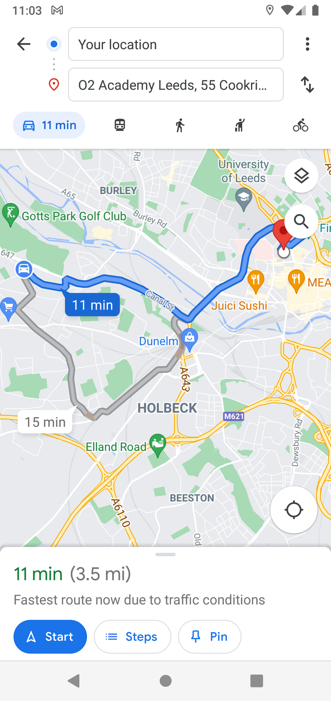

## A native Android mobile app for events management

The app allows to create and manage a list of live music events alongside with associeted venues.

### Events list / list sortation / event addition

||||
|--|--|--|

### Event details & addition to Google Calendar

|||
|--|--|

|||
|--|--|

### Venues list / venues sortation

|||
|--|--|

### Venue autocompletion using Google Palces API

|||
|--|--|

### Venue details with upcoming events, Google Maps location and dialable phone number

||||
|--|--|--|